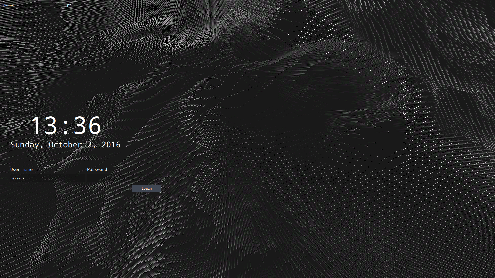

# Abstract Dark theme for SDDM

This theme was inspired by
[solarized-sddm-theme](https://github.com/MalditoBarbudo/solarized_sddm_theme)

This theme was futher modified by Maileo8

#### Changing font in `theme.conf`:

example:

```
[General]
background=background.png
displayFont="Montserrat"
```

## Screenshot



## License

Theme is licensed under GPL.
QML file is MIT licensed.
